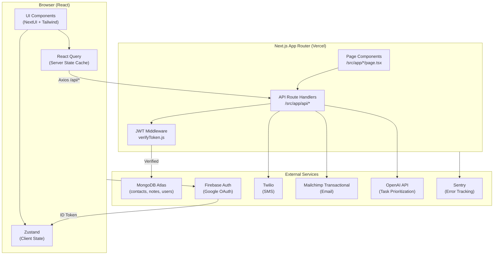

<div align="center">

# Redberry CRM

**A lightweight, full-stack CRM built for small businesses — no signup friction, just sign in with Google and get to work.**

[](https://www.redberry-crm.com/)
[](https://nextjs.org/)
[](https://www.typescriptlang.org/)
[](https://www.mongodb.com/atlas)
[](https://vercel.com/)

</div>

---

## Overview

Redberry CRM is a production-grade contact management system designed for small businesses that need a fast, no-friction tool to manage leads and customer relationships. Rather than onboarding users through email signup flows, Redberry uses Google OAuth — zero friction, zero forgotten passwords.

The application is fully self-contained: a Next.js monorepo that handles both the frontend React application and the backend API routes, backed by MongoDB Atlas and deployed to Vercel.

### Screenshots

> _Screenshots coming soon — contributions welcome._

| Overview Dashboard | Contacts — Table View | Contacts — Board View |
|---|---|---|
|  |  |  |

---

## Architecture

Redberry follows a **full-stack monorepo** architecture using Next.js App Router. There is no separate backend service — all API logic lives in `/src/app/api` as Next.js Route Handlers, co-located with the frontend. This eliminates network round-trips between services and simplifies deployment to a single Vercel project.



### Request Flow

1. The user authenticates via Google through Firebase. Firebase returns a signed ID token.
2. The ID token is stored in Zustand and injected as a `Bearer` header on every outbound request via the Axios HTTP client (`/src/services/http.ts`).
3. Protected API routes pass the token through `verifyToken.js` (Google Auth Library) before hitting MongoDB.
4. React Query manages all server state — caching, background refetching, and optimistic updates — so the UI never blocks on a network call.

---

## Tech Stack

Every dependency here was chosen deliberately. The table below explains the *why*, not just the *what*.

| Layer | Technology | Rationale |
|---|---|---|
| **Framework** | [Next.js 15](https://nextjs.org/) (App Router) | Co-locating API routes with the frontend eliminates a separate backend service. App Router's React Server Components reduce client bundle size for static content. |
| **Language** | [TypeScript 5](https://www.typescriptlang.org/) | Strict mode enabled throughout. Shared types between frontend components and API route handlers prevent contract drift without a separate type-generation step. |
| **UI Components** | [NextUI v2](https://nextui.org/) + [Ant Design v5](https://ant.design/) | NextUI covers the primary component set (inputs, selects, navbars) with first-class Tailwind integration. Ant Design fills gaps (complex data tables, date pickers) where battle-tested primitives save time. |
| **Styling** | [Tailwind CSS v3](https://tailwindcss.com/) + [Styled Components v6](https://styled-components.com/) | Tailwind handles layout and utility classes at development speed. Styled Components handles dynamic theming (dark mode) where CSS-in-JS is genuinely more expressive. |
| **Server State** | [React Query v3](https://tanstack.com/query/v3) | Separates server state from UI state entirely. Optimistic updates are implemented at the mutation level, keeping component code clean. Devtools in development accelerate debugging cache behaviour. |
| **Client State** | [Zustand v4](https://zustand-demo.pmnd.rs/) | Minimal API, no boilerplate, works outside of React components (useful for the Axios interceptor pattern). Used strictly for UI state (current user, modal visibility, active navigation). |
| **Forms** | [React Hook Form v7](https://react-hook-form.com/) + [Zod v3](https://zod.dev/) | Uncontrolled form inputs via RHF keep re-renders minimal. Zod schemas are the single source of truth for validation — the same schema is used client-side (via `@hookform/resolvers`) and server-side (API route validation). |
| **Database** | [MongoDB Atlas](https://www.mongodb.com/atlas) (Serverless) | Schema-flexible enough to accommodate evolving CRM data models without migrations. Atlas Serverless scales to zero, appropriate for a product at this stage. |
| **Authentication** | [Firebase Auth](https://firebase.google.com/docs/auth) + Google OAuth | Delegates credential management entirely. Token verification server-side uses Google Auth Library — stateless, no session store required. |
| **Email** | [Mailchimp Transactional (Mandrill)](https://mailchimp.com/developer/transactional/) | Reliable transactional delivery with open/click tracking, appropriate for CRM-originated emails. |
| **SMS** | [Twilio](https://www.twilio.com/) | Industry-standard SMS API with a straightforward Node.js SDK. |
| **AI** | [OpenAI API](https://platform.openai.com/) (GPT-3.5-turbo) | Powers the dashboard task prioritization feature. GPT-3.5-turbo is cost-effective for classification and prioritization tasks that don't require deep reasoning. |
| **Error Tracking** | [Sentry](https://sentry.io/) | Integrated at the Next.js config level with source map upload. Client-side errors are annotated with React component names automatically. |
| **Deployment** | [Vercel](https://vercel.com/) | Zero-config for Next.js, preview deployments per PR, edge network for static assets. |

---

## Key Technical Decisions & Tradeoffs

### 1. Monorepo: Frontend + Backend in a Single Next.js Project

**Decision:** All API logic lives as Next.js Route Handlers inside `/src/app/api/`, co-located with the frontend.

**Tradeoff:** This removes the operational overhead of running, deploying, and versioning a separate backend service. The downside is that all backend code runs inside a serverless function context — long-running tasks (e.g., bulk email sends) are not suitable here without an external queue.

---

### 2. Optimistic UI Updates at the React Query Layer

**Decision:** All mutations (create, update, delete) implement optimistic cache updates in the `onMutate` callback before the server confirms the operation.

```typescript
// /src/app/Contacts/page.tsx (pattern)
const deleteMutation = useMutation((id: string) => deleteContact(id), {
    onMutate: async (id) => {
        await queryClient.cancelQueries('contacts');
        const previous = queryClient.getQueryData('contacts');
        queryClient.setQueryData('contacts', (old: any) =>
            old.filter((item: any) => item._id !== id)
        );
        return { previous };
    },
    onError: (_err, _id, context) => {
        queryClient.setQueryData('contacts', context?.previous);
    },
    onSuccess: () => queryClient.invalidateQueries('contacts'),
});
```

**Tradeoff:** The UI feels instant. The rollback-on-error path handles the failure case. This pattern makes the code slightly more verbose per mutation but delivers a meaningfully better user experience on high-latency connections.

---

### 3. Zod as the Single Validation Source of Truth

**Decision:** Zod schemas in `/src/types.ts` and `/src/app/api/apiTypes.ts` are shared between client-side form validation (via `@hookform/resolvers/zod`) and server-side API route validation.

**Tradeoff:** A single schema change propagates to both layers automatically, eliminating drift. The tradeoff is a slightly heavier client bundle (Zod is ~14kb gzipped), which is acceptable given its role in form UX.

---

### 4. Stateless JWT Authentication (No Session Store)

**Decision:** Firebase ID tokens are verified server-side using the Google Auth Library on every request. There is no session table or Redis store.

**Tradeoff:** No server-side state to manage or expire. Every request is independently verifiable. The tradeoff is that token revocation requires waiting for the token's natural expiry (~1 hour) — acceptable for a CRM with no immediate account-termination requirement.

---

### 5. Dual-View for Contacts: Table vs. Kanban Board

**Decision:** The Contacts page renders either a sortable data table (`ContactTableView`) or a Kanban board (`ContactBoardView`) based on a view toggle. Both views share the same React Query cache and optimistic mutation logic.

**Tradeoff:** Two maintained view components add complexity. The benefit is that users with different working styles (list-oriented vs. pipeline-oriented) can operate the same underlying data model in the way that fits them.

---

## Getting Started

### Prerequisites

- Node.js >= 18.17.0
- A MongoDB Atlas account (free tier works)
- A Firebase project with Google Sign-In enabled
- Accounts for: Twilio, Mailchimp Transactional, OpenAI (optional — for AI features)

### 1. Clone & Install

```bash
git clone https://github.com/DavidMarom/redberry-crm.git
cd redberry-crm
npm install
```

### 2. Configure Environment Variables

Create a `.env.local` file in the project root:

```env
# MongoDB
MONGODB_URI=mongodb+srv://<user>:<password>@cluster.mongodb.net/rb

# Firebase (Client-side)
NEXT_PUBLIC_FIREBASE_API_KEY=
NEXT_PUBLIC_FIREBASE_AUTH_DOMAIN=
NEXT_PUBLIC_FIREBASE_PROJECT_ID=
NEXT_PUBLIC_FIREBASE_STORAGE_BUCKET=
NEXT_PUBLIC_FIREBASE_MESSAGING_SENDER_ID=
NEXT_PUBLIC_FIREBASE_APP_ID=

# Twilio
TWILIO_ACCOUNT_SID=
TWILIO_AUTH_TOKEN=
TWILIO_FROM_NUMBER=+1xxxxxxxxxx

# Mailchimp Transactional (Mandrill)
MAILCHIMP_API_KEY=

# OpenAI
OPENAI_API_KEY=

# Sentry (optional — remove from next.config.js to disable)
SENTRY_AUTH_TOKEN=
```

> **Note:** Firebase credentials prefixed with `NEXT_PUBLIC_` are exposed to the browser. These are safe to expose — Firebase Security Rules and the server-side token verification layer protect actual data access.

### 3. Run the Development Server

```bash
npm run dev
```

Open [http://localhost:3000](http://localhost:3000). Sign in with your Google account — the app will create your user record on first login and send a welcome email if Mailchimp is configured.

### 4. Build for Production

```bash
npm run build
npm start
```

### Project Structure

```
redberry-crm/
├── src/
│   ├── app/
│   │   ├── api/                  # Next.js Route Handlers (backend)
│   │   │   ├── contacts/         # Contact CRUD + [owner] dynamic route
│   │   │   ├── notes/            # Notes CRUD + [owner] dynamic route
│   │   │   ├── users/            # User management
│   │   │   ├── sms/              # Twilio SMS
│   │   │   ├── send-mail/        # Mailchimp transactional email
│   │   │   ├── openai/           # AI task prioritization
│   │   │   └── apiTypes.ts       # Zod schemas for API validation
│   │   ├── Contacts/             # Contacts page + Table/Board views
│   │   ├── Notes/                # Notes page
│   │   ├── Email/                # Email composition page
│   │   ├── Overview/             # Dashboard + charts + AI recommendations
│   │   ├── Settings/             # User profile settings
│   │   ├── layout.tsx            # Root layout (providers, navigation)
│   │   └── page.tsx              # Home — renders Overview
│   ├── components/               # Shared UI components
│   │   ├── SideBar/              # Responsive navigation sidebar
│   │   ├── Header/               # Top bar with user profile
│   │   └── LandingPage/          # Unauthenticated landing page
│   ├── services/                 # Service layer (API clients, MongoDB, auth)
│   │   ├── http.ts               # Axios instance (base URL, auth header)
│   │   ├── contacts.ts           # Contact API functions
│   │   ├── notes.ts              # Notes API functions
│   │   ├── users.ts              # User API functions
│   │   ├── mongo.ts              # MongoDB connection + operations
│   │   ├── auth.ts               # Google OAuth handlers
│   │   ├── sms.ts                # SMS service
│   │   ├── mailchimp.ts          # Email service
│   │   ├── openai.ts             # AI service
│   │   └── middlewares/
│   │       └── verifyToken.js    # JWT verification middleware
│   ├── store/                    # Zustand stores
│   │   ├── user.js               # Auth state, user profile
│   │   ├── contacts.js           # Contact edit state
│   │   ├── popup.js              # Modal visibility
│   │   └── navigation.js         # Active route state
│   ├── utils/                    # Pure utility functions
│   │   ├── utils.ts              # localStorage helpers, text truncation
│   │   ├── userUtils.ts          # Sign-in / sign-out orchestration
│   │   └── contactsUtils.ts      # Contact-specific helpers
│   └── types.ts                  # Zod schemas + inferred TypeScript types
├── public/                       # Static assets
├── next.config.js                # Next.js + Sentry config
├── tailwind.config.ts            # Tailwind theme + NextUI plugin
└── tsconfig.json                 # TypeScript (strict mode, @/* path alias)
```

---

## Features

### Contact Management
Full CRUD for contacts with per-user data isolation (`owner` field tied to Firebase UID). Supports custom status values, phone, email, and freeform notes per contact.

**Technically:** Contacts are stored in MongoDB with the user's Firebase UID as the `owner` field. All API routes under `/api/contacts/[owner]` return only records matching the authenticated user's UID, enforced server-side.

---

### Dual-View: Table & Kanban Board
Switch between a sortable data table and a Kanban board grouped by contact status. Both views share the same React Query cache — switching view does not re-fetch.

**Technically:** View state is local to the Contacts page component. The React Query query key `"contacts"` is shared between both view components, so the data is hydrated once and rendered differently.

---

### Email Composition & Sending
Compose and send transactional emails to contacts directly from the CRM. Built with React Hook Form + Zod validation for the composition form, routed through the `/api/send-mail` handler to Mailchimp Transactional (Mandrill).

---

### SMS Messaging
Send an SMS to any contact with a phone number on file. The `/api/sms` route dispatches through Twilio's REST API using server-side credentials — the Twilio auth token is never exposed to the browser.

---

### AI-Powered Task Recommendations
The Overview dashboard includes an AI recommendations panel that sends the user's current contact list to the `/api/openai` route. GPT-3.5-turbo analyzes contact statuses and returns prioritized action suggestions.

**Technically:** The prompt is constructed server-side from the user's live contact data. Responses are streamed back and rendered in the dashboard panel. This feature degrades gracefully if the OpenAI API key is not configured.

---

### Notes
A freeform notes board scoped to the authenticated user. Notes are stored in MongoDB and protected by JWT middleware — the `/api/notes` route requires a valid Bearer token, unlike public contact routes.

---

### Dashboard Analytics
The Overview page renders two charts built with Recharts: a contact growth timeline (`Graph01`) and a status distribution pie chart (`PieChart`). Both are computed client-side from the React Query contacts cache — no separate analytics API call.

---

### Google OAuth Authentication
One-click sign-in with Google. Firebase handles the OAuth flow, returns a signed ID token, which is verified server-side on protected routes using the Google Auth Library. A welcome email is dispatched on first login.

---

### Dark Mode
Full dark mode support via `next-themes`. Theme preference is persisted in `localStorage` and applied at the `<html>` level to prevent flash on load. The Tailwind config includes dark mode class variants throughout.

---

### Responsive Navigation
Two sidebar variants render based on viewport: a full text-and-icon sidebar on desktop and an icon-only compact sidebar on mobile. Navigation active state is managed in Zustand and syncs with the Next.js router.

---

## Roadmap

The following features are planned. Contributions are welcome — see [Contributing](#contributing) below.

- [ ] **Bulk actions** — select multiple contacts for batch status update, email, or delete
- [ ] **Contact import/export** — CSV import for migrating from other CRMs, CSV/JSON export
- [ ] **Activity timeline** — per-contact log of emails sent, SMS sent, notes added, status changes
- [ ] **Pipeline stages** — customizable Kanban columns (beyond the current status field)
- [ ] **Team accounts** — multi-user workspaces with role-based access (owner / editor / viewer)
- [ ] **Contact tagging** — free-form tags for filtering and segmentation beyond status
- [ ] **Reminders & follow-ups** — schedule a follow-up action on a contact with a notification
- [ ] **Email templates** — save and reuse email compositions
- [ ] **Real-time collaboration** — live presence and cursor tracking via Ably (infrastructure partially in place)
- [ ] **Test coverage** — Jest + React Testing Library for unit tests; Playwright for E2E

---

## Contributing

### Branching Convention

For each ticket or feature, create a branch from `main` using the following convention:

```
yourFirstName/RED-#ticketNumber
# Example: david/RED-47
```

### Development Workflow

1. Fork the repository and create your branch
2. Make your changes
3. Run the linter before opening a PR:
   ```bash
   npm run lint
   ```
4. Open a pull request against `main` with a clear description of what changed and why

### Code Conventions

- **TypeScript strict mode** is enforced — no `any` types without an explicit comment explaining why
- **Zod schemas** are the canonical source for any data shape — add new schemas to `/src/types.ts` (frontend models) or `/src/app/api/apiTypes.ts` (API payloads) before implementing
- **React Query** for all server state — do not use `useState` + `useEffect` for data fetching
- **Zustand** for UI state only — authentication state, modal visibility, active navigation
- Service functions live in `/src/services/` — components should not call `axios` or `fetch` directly
- Validate API request bodies at the route handler level using the Zod schemas in `apiTypes.ts`

### Reporting Issues

Open an issue on [GitHub](https://github.com/DavidMarom/redberry-crm/issues) with:
- A clear description of the bug or feature request
- Steps to reproduce (for bugs)
- Expected vs. actual behaviour

---

## License

MIT © [David Marom](https://github.com/DavidMarom)
